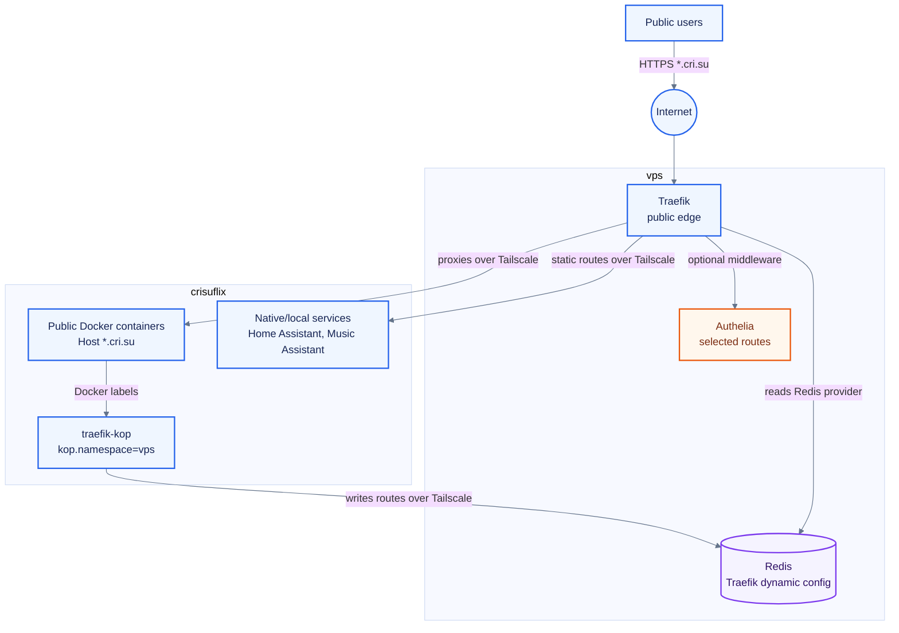
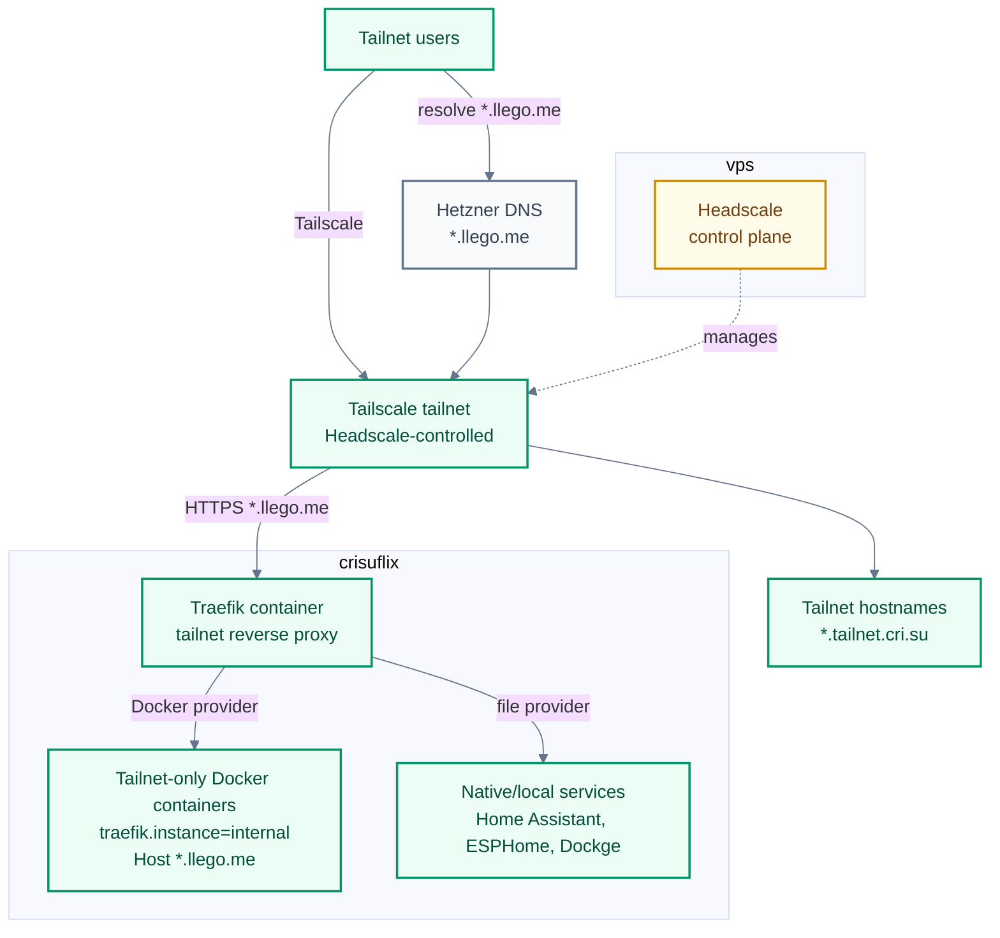

# NixOS Configuration

Multi-host NixOS flake.

## Hosts

| Host        | Purpose               |
| ----------- | --------------------- |
| `laptop`    | Daily driver          |
| `vps`       | Public edge           |
| `crisuflix` | NAS and home services |
| `rpi5`      | Home Assistant kiosk  |

## Public And Tailnet Routing

Public `*.cri.su` services terminate at Traefik on `vps`. Docker containers on `crisuflix` can publish selected Traefik labels with traefik-kop into Redis on `vps`, over the Headscale-managed Tailscale network. The edge Traefik reads those Redis routes and proxies back to `crisuflix` over the tailnet. A separate Traefik container on `crisuflix` publishes `*.llego.me` services to tailnet users; DNS for `*.llego.me` is managed in Hetzner. Authelia protects selected public routes, while private services stay reachable only through Tailscale.





- Public `*.cri.su` routes are served by `vps` Traefik and may use Authelia middleware.
- Tailnet `*.llego.me` routes are served by the Traefik container on `crisuflix`.
- Docker services on `crisuflix` use local Traefik labels for `*.llego.me` or `kop.namespace=vps` labels for the Redis-backed `vps` Traefik path.
- Tailnet-only services avoid public routers and are reachable through Tailscale, including `*.llego.me` and `*.tailnet.cri.su` names.
- Headscale runs on `vps` and provides the control plane for the tailnet that links the hosts.

## Layout

| Path         | Purpose                     |
| ------------ | --------------------------- |
| `hosts/`     | Per-machine NixOS configs   |
| `modules/`   | Reusable NixOS modules      |
| `dots/`      | User config sources         |
| `pkgs/`      | Local packages              |
| `secrets/`   | agenix secrets              |
| `docs/`      | Long-form notes             |
| `HANDOFF.md` | Current state, next actions |

## Secrets

Secrets use [agenix](https://github.com/ryantm/agenix) and are encrypted to SSH host keys plus user keys from `secrets.nix`.

```bash
agenix -e secrets/initial-password.age
agenix -r
```

## Custom Packages

Packages in `pkgs/` are standalone flakes with `inputs.nixpkgs.follows = "nixpkgs"`.
