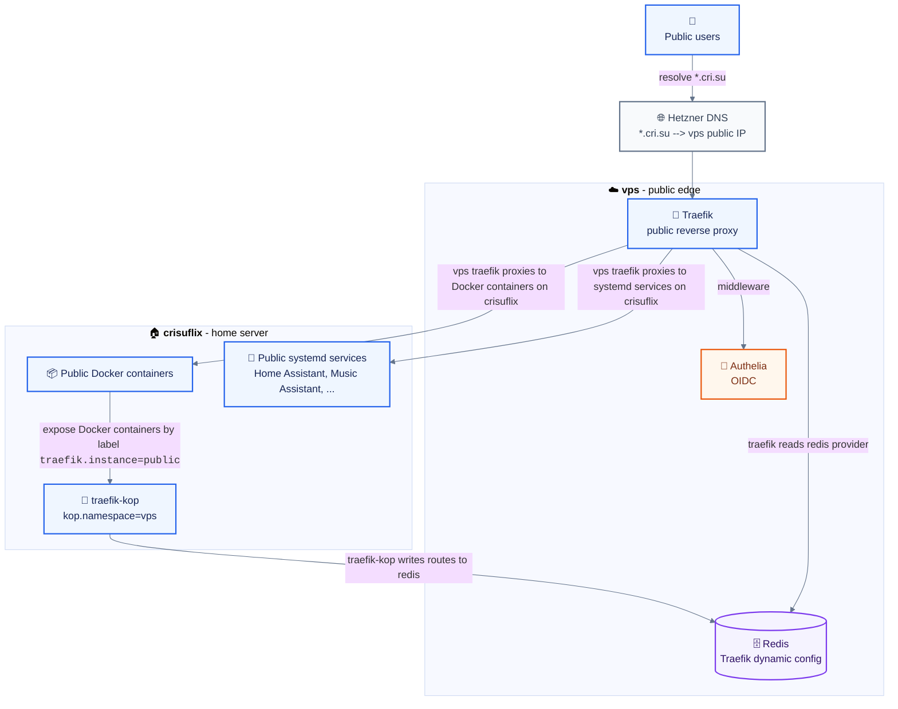

# NixOS Configuration

This is my overly complex nixconfig which covers basically all of my machines. Most of the configuration is AI generated.

Docker Compose files are not available in a public repo.

## Hosts

| Host        | Purpose               |
| ----------- | --------------------- |
| `laptop`    | Daily driver          |
| `vps`       | Public edge           |
| `crisuflix` | NAS and home services |
| `rpi5`      | Home Assistant kiosk  |

Notable pieces of software in my infrastructure that bring me joy:

- **NixOS:** [hjem](https://github.com/feel-co/hjem), [hjem-impure](https://github.com/Rexcrazy804/hjem-impure), [disko](https://github.com/nix-community/disko)
- **Storage:** [ZFS](https://openzfs.org/), [Sanoid](https://github.com/jimsalterjrs/sanoid), [Restic](https://restic.net/)
- **Media management:** [Jellyfin](https://jellyfin.org/), [SABnzbd](https://sabnzbd.org/), [Servarr](https://wiki.servarr.com/), [Grimmory](https://github.com/gabe565/grimmory), [Immich](https://immich.app/)
- **Networks:** [Traefik](https://traefik.io/), [traefik-kop](https://github.com/jittering/traefik-kop), [Authelia](https://www.authelia.com/), [Tailscale](https://tailscale.com/), [Headscale](https://headscale.net/), [Headplane](https://github.com/tale/headplane), [Homepage](https://gethomepage.dev/)
- **Desktop environment:** [Niri](https://github.com/YaLTeR/niri), [Noctalia](https://github.com/noctalia-dev/noctalia), [Helix editor](https://helix-editor.com/), [Yazi](https://yazi-rs.github.io/), [Foot](https://codeberg.org/dnkl/foot), [Zen Browser](https://zen-browser.app/)
- **Home automation:** [Home Assistant](https://www.home-assistant.io/), [Music Assistant](https://music-assistant.io/), [Frigate](https://frigate.video/), [Gotify](https://gotify.net/)
- **Tools:** [OpenCloud](https://opencloud.eu/), [Notesnook](https://notesnook.com/), [I Hate Money](https://ihatemoney.org/), [SparkyFitness](https://github.com/CodeWithCJ/SparkyFitness)

## Public And Tailnet Routing

Public `*.cri.su` services terminate at Traefik on `vps`. Selected Docker containers on `crisuflix` are published via [traefik-kop](https://github.com/jittering/traefik-kop) using Docker labels with into Redis on `vps`, over the Headscale-managed Tailscale network. The edge Traefik reads those Redis routes and proxies back to `crisuflix` over the tailnet. A separate Traefik instance on `crisuflix` publishes `*.llego.me` services to tailnet users. Authelia protects public routes, while private services stay reachable only through Tailscale.

```mermaid
%%{init: {"theme": "base", "themeVariables": {"fontFamily": "ui-sans-serif, system-ui, sans-serif", "primaryBorderColor": "#64748b", "lineColor": "#64748b"}}}%%
flowchart TB
  classDef tailnet fill:#ecfdf5,stroke:#059669,color:#064e3b,stroke-width:2px
  classDef dns fill:#f8fafc,stroke:#64748b,color:#334155,stroke-width:2px
  classDef control fill:#fefce8,stroke:#ca8a04,color:#713f12,stroke-width:2px

  subgraph TailnetVPS["☁️ <strong>vps</strong>"]
    direction TB
    Headscale["🧭 Headscale<br/>control plane"]
  end

  subgraph TailnetCrisuflix["🏠 <strong>crisuflix</strong> - home server"]
    direction TB
    LocalTraefik["🚦 Traefik <br/> tailnet reverse proxy"]
    InternalContainers["🔒📦 Tailnet-only Docker containers"]
    InternalLocalServices["🧩 Native/local services<br/>Home Assistant, ESPHome, Dockge"]
  end

  TailnetUsers["🧑<br/>Tailnet users"] -->|resolve *.llego.me| HetznerDNS["🌐 Hetzner DNS<br/>*.llego.me --> crisuflix tailnet IP"]
  TailnetUsers -->|Tailscale| Tailnet["🕸️ Tailscale tailnet"]
  HetznerDNS --> Tailnet
  Headscale -. manages .-> Tailnet
  Tailnet --> LocalTraefik
  LocalTraefik -->|connect to Docker containers with label <code>traefik.instance=internal</code>| InternalContainers
  LocalTraefik -->|file provider| InternalLocalServices

  class TailnetUsers,Tailnet,LocalTraefik,InternalContainers,InternalLocalServices,TailnetDNS tailnet
  class HetznerDNS dns
  class Headscale control
```





- Public `*.cri.su` routes are served by `vps` Traefik and may use Authelia middleware.
- Tailnet `*.llego.me` routes are served by the Traefik container on `crisuflix`.
- Docker services on `crisuflix` use local Traefik labels for `*.llego.me` or `kop.namespace=vps` labels for the Redis-backed `vps` Traefik path.
- Tailnet-only services avoid public routers and are reachable through Tailscale, including `*.llego.me` and `*.tailnet.cri.su` names.
- Headscale runs on `vps` and provides the control plane for the tailnet that links the hosts.

## Layout

| Path         | Purpose                     |
| ------------ | --------------------------- |
| `hosts/`     | Per-machine NixOS configs   |
| `modules/`   | Reusable NixOS modules      |
| `dots/`      | User config sources         |
| `pkgs/`      | Local packages              |
| `secrets/`   | agenix secrets              |
| `docs/`      | Long-form notes             |
| `HANDOFF.md` | Current state, next actions |

## Secrets

Secrets use [agenix](https://github.com/ryantm/agenix) and are encrypted to SSH host keys plus user keys from `secrets.nix`.

```bash
agenix -e secrets/initial-password.age
agenix -r
```

## Custom Packages

Packages in `pkgs/` are standalone flakes with `inputs.nixpkgs.follows = "nixpkgs"`.
