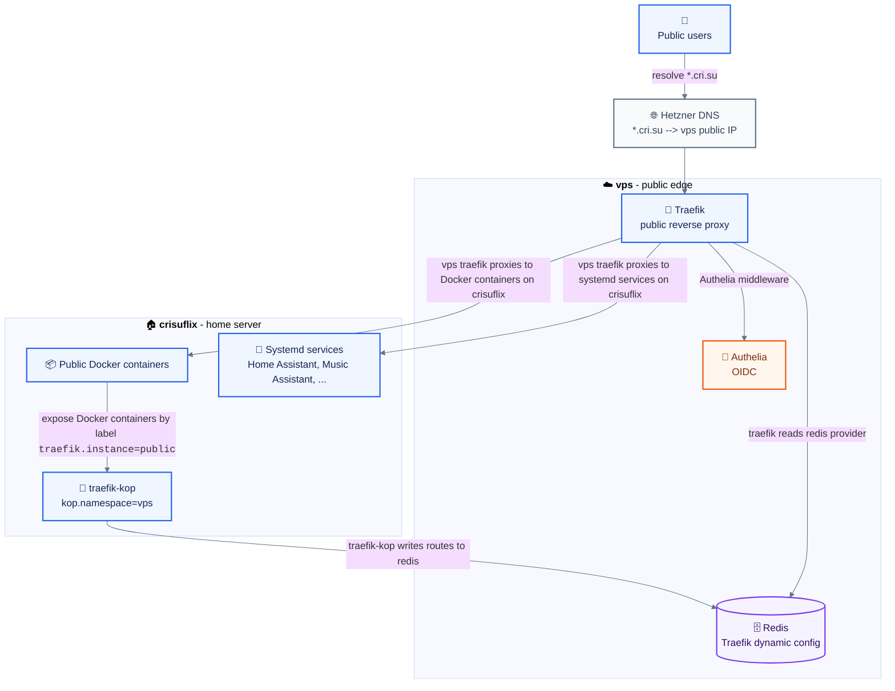
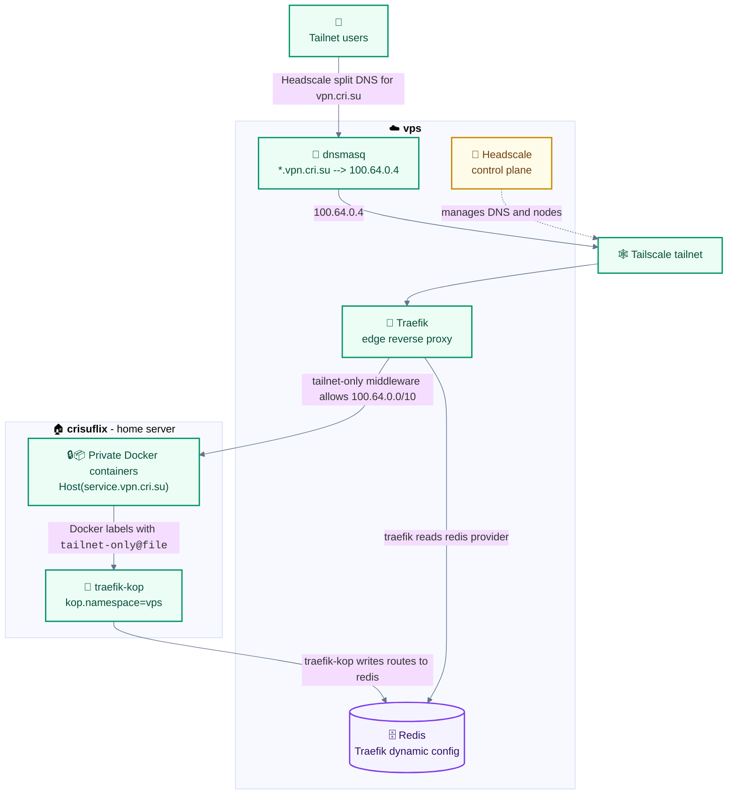

# NixOS Configuration

This is my (perhaps overly complex) nixconfig which covers basically all of my machines. Most of the configuration is AI generated.

My Docker Compose files are not available in this repo.

## Hosts

| Host        | Purpose               |
| ----------- | --------------------- |
| `laptop`    | Daily driver          |
| `vps`       | Public edge           |
| `crisuflix` | NAS and home services |
| `rpi5`      | Home Assistant kiosk  |

Notable pieces of software in my infrastructure that bring me joy (some of these are running as Docker containers and therefore not configured in this repo):

- **NixOS:** [hjem](https://github.com/feel-co/hjem), [hjem-impure](https://github.com/Rexcrazy804/hjem-impure), [disko](https://github.com/nix-community/disko), [agenix](https://github.com/ryantm/agenix), [mcp-nixos](https://github.com/utensils/mcp-nixos)
- **Storage:** [ZFS](https://openzfs.org/), [Sanoid](https://github.com/jimsalterjrs/sanoid), [Restic](https://restic.net/)
- **Media management:** [Jellyfin](https://jellyfin.org/), [SABnzbd](https://sabnzbd.org/), [Servarr](https://wiki.servarr.com/), [Grimmory](https://github.com/gabe565/grimmory), [Immich](https://immich.app/), [Beets](https://beets.io/)
- **Networks:** [Traefik](https://traefik.io/), [traefik-kop](https://github.com/jittering/traefik-kop), [Authelia](https://www.authelia.com/), [Tailscale](https://tailscale.com/), [Headscale](https://headscale.net/), [Headplane](https://github.com/tale/headplane)
- **Admin and monitoring:** [Dockge](https://dockge.kuma.pet/), [Gotify](https://gotify.net/), [Homepage](https://gethomepage.dev/), [Uptime Kuma](https://uptime.kuma.pet/), [Beszel](https://beszel.dev/)
- **Desktop environment:** [Niri](https://github.com/YaLTeR/niri), [Noctalia](https://github.com/noctalia-dev/noctalia), [Helix](https://helix-editor.com/), [Yazi](https://yazi-rs.github.io/), [Foot](https://codeberg.org/dnkl/foot), [Zen Browser](https://zen-browser.app/), [OpenCode](https://opencode.ai/)
- **Home automation:** [Home Assistant](https://www.home-assistant.io/), [Music Assistant](https://music-assistant.io/), [Frigate](https://frigate.video/)
- **Tools:** [OpenCloud](https://opencloud.eu/), [Notesnook](https://notesnook.com/), [I Hate Money](https://ihatemoney.org/), [SparkyFitness](https://github.com/CodeWithCJ/SparkyFitness)

## Public And Tailnet Routing

Public `*.cri.su` services terminate at Traefik on `vps`. Selected Docker containers on `crisuflix` are published via [traefik-kop](https://github.com/jittering/traefik-kop) using Docker labels into Redis on `vps`, over the Headscale-managed Tailscale network. The edge Traefik reads those Redis routes and proxies back to `crisuflix` over the tailnet. Private Docker services use `*.vpn.cri.su`: Headscale sends that split-DNS zone to `dnsmasq` on `vps`, which wildcard-resolves it to the VPS tailnet IP, and Traefik routers protect those names with the `tailnet-only` middleware. Authelia protects public routes, while private services stay reachable only through Tailscale.

### Public users accessing \*.cri.su



### Tailnet users accessing \*.vpn.cri.su



## Layout

| Path         | Purpose                     |
| ------------ | --------------------------- |
| `hosts/`     | Per-machine NixOS configs   |
| `modules/`   | Reusable NixOS modules      |
| `dots/`      | Userspace dotfiles          |
| `pkgs/`      | Custom packages             |
| `secrets/`   | agenix secrets              |
| `docs/`      | Long-form notes             |
| `HANDOFF.md` | Current state, next actions |

## Secrets

Secrets use [agenix](https://github.com/ryantm/agenix) and are encrypted to SSH host keys plus user keys from `secrets.nix`.

```bash
agenix -e secrets/initial-password.age
agenix -r
```

## Custom Packages

Packages in `pkgs/` are standalone flakes with `inputs.nixpkgs.follows = "nixpkgs"`.

`pkgs/album-downloader` exposes both the cheap `album-downloader` shell wrapper and the expensive `bandsnatch` Rust package. `bandsnatch` keeps its own pinned dependency graph so root `nixpkgs` updates do not churn its store path. If that package flake changes, prime `llego.cachix.org` from inside the package flake before rebuilding clean hosts:

```bash
cd pkgs/album-downloader
nix build .#bandsnatch
cachix push llego ./result
```
